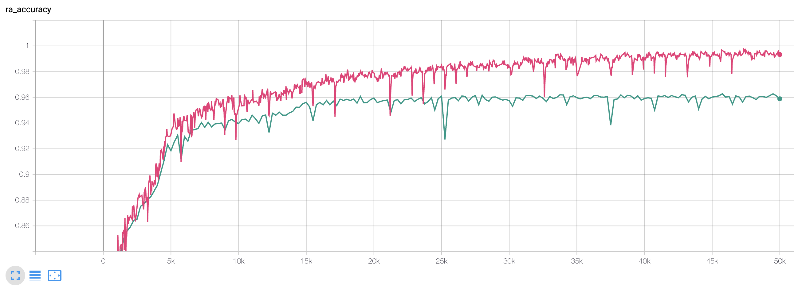

# catbAbI experiment

This folder contains code to run the FWM model on the catbAbI dataset. The code is not optimised for speed. Training the default config on a v100 for 50k steps will take about 15h. However, the model reaches 90 % validation set accuracy after about 7.2k steps which takes about 2h. In the paper we introduce the QM accuracy, i.e. the accuracy constraint to the tokens following the question mark, but in the code and logs it is named RA accuracy. They are identical. Tensorboard provides a nice way to visualise the per-task performance. Task 0 is refers to the average performance on all tasks which is our main metric and is tracked under the name ra_acc_task_0 or ra_accuracy. On catbAbI the residual connection between the LSTM and FWM is not really necessary and slightly hurts performance in the LM setting but was necessary to beat AWD-LSTM on PTB language modelling without a significant amount of hyperparameter tuning.

To train the FWM model in QM/RA or LM mode checkout or run the respective shell scripts on one GPU. Training the model in QM mode should result in the following train and validation accuracy curves:



## Instructions
```
$ python3 --version
Python 3.6.9
$ cat req.txt 
munch==2.5.0
numpy==1.17.2
sacred==0.8.1
tensorboard==2.1.0
tensorboardX==1.9
torch==1.6.0
```

Install the necessary packages ```pip3 install -r req.txt```

Run ```download_and_preprocess.sh``` to download and preprocess the official bAbI v1.2 dataset. 

Train with ```CUDA_VISIBLE_DEVICES=0 ./fwm_catbabi_ra.sh```

A batch size 1 test evaluation is run at the very end and the result is written to the log file in the log folder.
