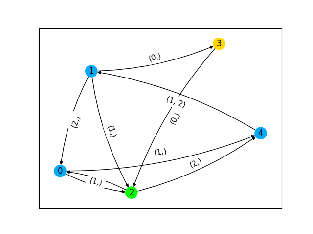
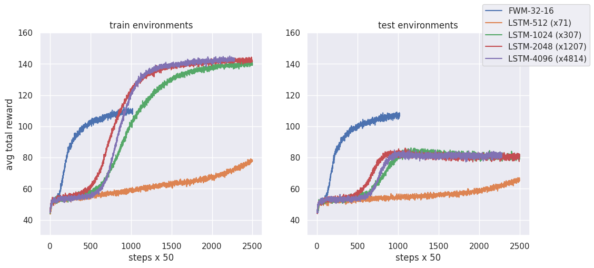

# Meta Reinforcement Learning Experiment

Runs an LSTM-based RL agent with and without Fast Weight Memory (FWM) on randomly generated graph environments. 



Run ```run.sh``` to train the agent and ```python3 plot_paper_figure.py paper_logs``` to generate the plot in the paper. 


